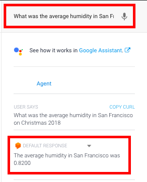

# Weather Rent API

API Link: https://weather-rent-app.herokuapp.com

## API Request Types

### Average weather over a date range request:

This request returns the average weather over the specified date range for a specified weather type and city.

Questions:
1. What was the average rainfall in Houston in August 2017?
2. Average humidity in San Francisco in June 2019?

#### Parameters

**YOURAPIKEY** - provided upon request

**city** - city of location as a string

**state** - state of location as a string

#### Example Query Strings:
1. https://<span></span>weather-rent-app.herokuapp.com/api/weather-rent/[YOURAPIKEY]?city=Houston&state=TX&startDate=2017-08-01&endDate=2017-08-31&weatherCondition=precipIntensit
    
#### Result

```json
{
    "status": "success",
    "data": {
        "weather": 0.0343,
        "query": {
            "city": "Houston",
            "state": "TX",
            "startDate": "2017-08-01",
            "endDate": "2017-08-31",
            "weatherCondition": "precipIntensity"
        }
    }
}
```

<h3>Bonus:</h3>

Post direct question to DialogFlow and get a fully automated, human-like response!<br>
 <br><br>

Use Postman or any API dev tool to make a POST request of any variation of the question below at the endpoint
<b>api/df_text_query<b>
    
```json
{
    "text": "What was the average rainfall in Houston in August 2017?"
}
```


<br> <br>
<hr>
<h3>Rent data based on city:</h3>

Questions:
1. Cities with rent between $1500 and $2000?
2. Which cities have a rent lower than $2000?
3. Cities that have rent equal $1500?

Example Query Strings:
1. /api/weather-rent/YOURAPIKEY?rent[gte]=1500&rent[lte]=2000
2. /api/weather-rent/YOURAPIKEY?rent=1500

#### Parameters
    
#### Result

```json
{
    "status": "success",
    "results": 5,
    "data": [
        {
            "_id": "5dabcaf3032ab97b9eff512e",
            "city": "West Jordan",
            "state": "UT",
            "rent": 1500
        },
        {
            "_id": "5dabcaf3032ab97b9eff621d",
            "city": "Morrisville",
            "state": "PA",
            "rent": 1500
        },
        {
            "_id": "5dabcaf3032ab97b9eff643a",
            "city": "Princeton",
            "state": "TX",
            "rent": 1500
        },
        {
            "_id": "5dabcaf4032ab97b9eff6b29",
            "city": "Fairfax",
            "state": "VT",
            "rent": 1500
        },
        {
            "_id": "5dabcaf4032ab97b9eff77fe",
            "city": "Ellenburg",
            "state": "NY",
            "rent": 1500
        }
    ]
}
```

<hr>
<h3>Average weather query over a date range and rent in city info:</h3>

Questions:
1. What cities have a rent less than $2000 but likely to be above 50 degrees Fahrenheit on New Year's Eve?<br>

Example Query Strings:
1. /api/weather-rent/YOURAPIKEY?date=2018-12-31&weatherCondition=temperature&weather[gt]=50&rent[lt]=2000&page=1&limit=20
#### Parameters
    
#### Result

```json
{
    "status": "success",
    "results": 13,
    "data": [
        {
            "_id": "5dabcaf3032ab97b9eff500e",
            "city": "Jacksonville",
            "state": "FL",
            "rent": 1151,
            "averageWeather": 65.566,
            "weatherType": "temperature",
            "fiveYearAvgFrom": "2018-12-31"
        },
        {
            "_id": "5dabcaf3032ab97b9eff5002",
            "city": "Phoenix",
            "state": "AZ",
            "rent": 1247,
            "averageWeather": 63.7,
            "weatherType": "temperature",
            "fiveYearAvgFrom": "2018-12-31"
        },
        {
            "_id": "5dabcaf3032ab97b9eff5003",
            "city": "Las Vegas",
            "state": "NV",
            "rent": 1239,
            "averageWeather": 51.314,
            "weatherType": "temperature",
            "fiveYearAvgFrom": "2018-12-31"
        },
        {
            "_id": "5dabcaf3032ab97b9eff5096",
            "city": "Columbus",
            "state": "GA",
            "rent": 813,
            "averageWeather": 54.136,
            "weatherType": "temperature",
            "fiveYearAvgFrom": "2018-12-31"
        },
        {
            "_id": "5dabcaf3032ab97b9eff50bc",
            "city": "Yuma",
            "state": "AZ",
            "rent": 933,
            "averageWeather": 63.02,
            "weatherType": "temperature",
            "fiveYearAvgFrom": "2018-12-31"
        },
        {
            "_id": "5dabcaf3032ab97b9eff50c0",
            "city": "Visalia",
            "state": "CA",
            "rent": 1236,
            "averageWeather": 51.826,
            "weatherType": "temperature",
            "fiveYearAvgFrom": "2018-12-31"
        },
        {
            "_id": "5dabcaf3032ab97b9eff50c1",
            "city": "Charleston",
            "state": "SC",
            "rent": 1794,
            "averageWeather": 54.04,
            "weatherType": "temperature",
            "fiveYearAvgFrom": "2018-12-31"
        },
        {
            "_id": "5dabcaf3032ab97b9eff50de",
            "city": "Metairie",
            "state": "LA",
            "rent": 1525,
            "averageWeather": 57.36,
            "weatherType": "temperature",
            "fiveYearAvgFrom": "2018-12-31"
        },
        {
            "_id": "5dabcaf3032ab97b9eff50df",
            "city": "McAllen",
            "state": "TX",
            "rent": 1200,
            "averageWeather": 58.854,
            "weatherType": "temperature",
            "fiveYearAvgFrom": "2018-12-31"
        },
        {
            "_id": "5dabcaf3032ab97b9eff5149",
            "city": "Madera",
            "state": "CA",
            "rent": 1189,
            "averageWeather": 52.694,
            "weatherType": "temperature",
            "fiveYearAvgFrom": "2018-12-31"
        },
        {
            "_id": "5dabcaf3032ab97b9eff5158",
            "city": "Vero Beach",
            "state": "FL",
            "rent": 1443,
            "averageWeather": 65.806,
            "weatherType": "temperature",
            "fiveYearAvgFrom": "2018-12-31"
        },
        {
            "_id": "5dabcaf3032ab97b9eff515c",
            "city": "Davie",
            "state": "FL",
            "rent": 1953,
            "averageWeather": 69.786,
            "weatherType": "temperature",
            "fiveYearAvgFrom": "2018-12-31"
        },
        {
            "_id": "5dabcaf3032ab97b9eff5173",
            "city": "Rialto",
            "state": "CA",
            "rent": 1699,
            "averageWeather": 58.786,
            "weatherType": "temperature",
            "fiveYearAvgFrom": "2018-12-31"
        }
    ]
}
  
```

